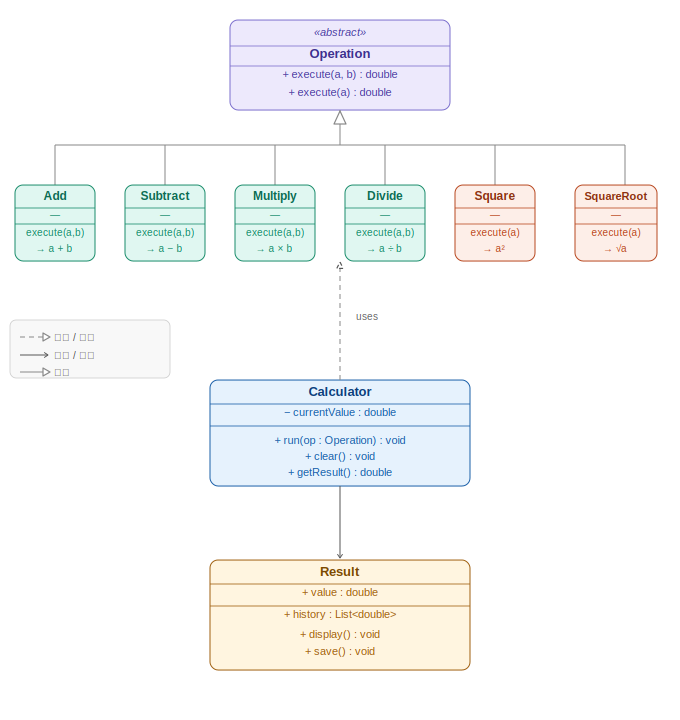

# 計算機

## 組別資訊
- 組別：第二組
- 系級：資工1A

## 組員資訊
- 組長:張定翔
- 組員:陳柏融、阮清田

## 小專題題目
- 計算機 (支援加、減、乘、除、平方、平方根)

## 系統功能說明
- 基本四則運算
- 一元運算（平方、平方根）
- 運算結果顯示與更新

## 程式介紹
### 類別與方法
- **Calculator**：主控制類
- **Operation (抽象類別)**：定義 `execute()` 方法
- **Add/Subtract/Multiply/Divide**：繼承 Operation，實作二元運算
- **Square/SquareRoot**：繼承 Operation，實作一元運算
- **Result**：顯示與儲存結果

## 程式使用方式
1. 輸入第一個數字
2. 選擇運算類型
3. 輸入第二個數字（若為二元運算）
4. 顯示結果並更新 `currentValue`

## 程式安裝與執行方式
- 編譯方式：
  下載程式碼運行於任一可執行C++語言之編譯器編譯並執行。​
- 執行流程:
  1. 輸入第一個數字
  2. 選擇運算類型
  3. 輸入第二個數字（若為二元運算）
  4. 顯示結果並更新 `currentValue`
  5. 可選擇繼續計算或結束程式
- 依賴環境:
  作業系統：Windows / macOS / Linux（任一皆可）
  編譯器：支援 C++11 以上標準 的編譯器（例如 g++、clang++、MSVC）
## 運行畫面

## UML圖片

## 分工資訊
- 張定翔​:負責程式設計、進度追蹤及最終整合、編寫專案文件、協調組員分工。​
- 陳柏融:主要負責核心運算邏輯的程式碼實作，包含物件導向類別的設計與函式開發。
- 阮清田​:負責程式測試與除錯。​
