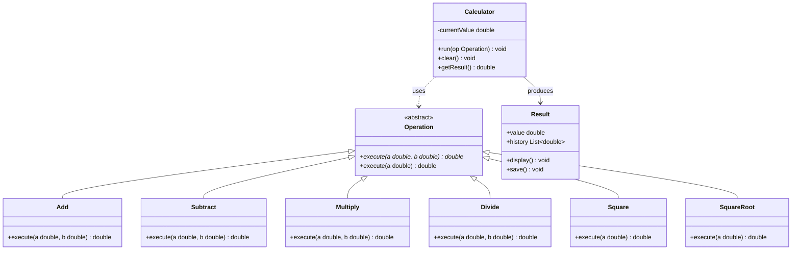

# Calculator — OOP 設計範例

以物件導向四大原則（封裝、繼承、多型、擴充性）實作的計算機系統。

---

## UML 類別圖



---

## 類別說明

### `Operation`（抽象類別）

所有運算的共同介面。

| 方法 | 說明 |
|---|---|
| `execute(a, b)` | 二元運算（純虛函式，子類別必須實作） |
| `execute(a)` | 一元運算（選擇性覆寫，預設可拋出例外） |

---

### 二元運算子類別

繼承自 `Operation`，實作 `execute(a, b)`。

| 類別 | 運算 | 回傳 |
|---|---|---|
| `Add` | 加法 | `a + b` |
| `Subtract` | 減法 | `a - b` |
| `Multiply` | 乘法 | `a * b` |
| `Divide` | 除法 | `a / b`（需處理除以零） |

---

### 一元運算子類別

繼承自 `Operation`，實作 `execute(a)`。

| 類別 | 運算 | 回傳 |
|---|---|---|
| `Square` | 平方 | `a²` |
| `SquareRoot` | 平方根 | `√a`（需處理負數） |

---

### `Calculator`

核心計算機類別，透過多型呼叫任意 `Operation`，自身不需知道運算細節。

| 成員 | 類型 | 說明 |
|---|---|---|
| `currentValue` | `double`（private） | 儲存目前計算結果 |
| `run(op)` | `void` | 呼叫運算物件並更新 `currentValue` |
| `clear()` | `void` | 重置 `currentValue` 為 0 |
| `getResult()` | `double` | 回傳目前結果 |

---

### `Result`（選用）

負責顯示與儲存歷史紀錄，與 `Calculator` 分離職責。

| 成員 | 類型 | 說明 |
|---|---|---|
| `value` | `double` | 儲存單筆結果 |
| `history` | `List<double>` | 儲存所有歷史紀錄 |
| `display()` | `void` | 顯示目前結果 |
| `save()` | `void` | 將結果存入 `history` |

---

## OOP 原則對應

| 原則 | 對應設計 |
|---|---|
| **封裝** | 每個運算類別只負責自己的邏輯；`currentValue` 為 private |
| **繼承** | `Add`、`Subtract` 等全部繼承自 `Operation` |
| **多型** | `Calculator::run()` 接收 `Operation&`，不需知道實際子類別 |
| **擴充性** | 新增運算只需再加一個繼承 `Operation` 的子類別，無需修改 `Calculator` |

---

## 檔案結構建議

```
calculator-oop/
├── README.md
├── include/
│   ├── Operation.h
│   ├── Add.h
│   ├── Subtract.h
│   ├── Multiply.h
│   ├── Divide.h
│   ├── Square.h
│   ├── SquareRoot.h
│   ├── Calculator.h
│   └── Result.h
├── src/
│   ├── Add.cpp
│   ├── Subtract.cpp
│   ├── Multiply.cpp
│   ├── Divide.cpp
│   ├── Square.cpp
│   ├── SquareRoot.cpp
│   ├── Calculator.cpp
│   └── Result.cpp
└── main.cpp
```
