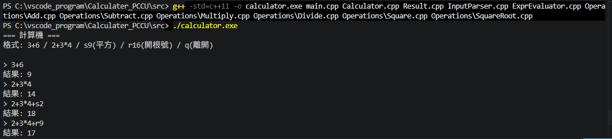
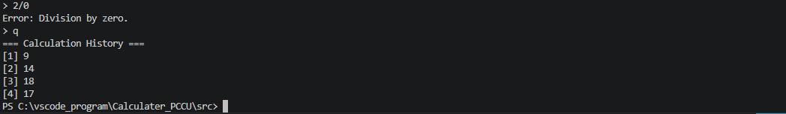

# 計算機

## 一、組別資訊

| 項目 | 內容 |
|------|------|
| 組別 | 第二組 |
| 系級班級 | 資工 1A |

## 二、組員資訊

| 角色 | 姓名 | 負責項目簡述 |
|------|------|------------|
| 組長 | 張定翔 | 程式設計、進度追蹤與最終整合、專案文件撰寫 |
| 組員 | 陳柏融 | 核心運算邏輯實作，包含物件導向類別設計與函式開發 |

## 三、小專題題目

計算機（支援基本運算、平方、平方根、歷史紀錄）

## 四、系統功能說明

- 基本四則運算（加、減、乘、除），支援多項連算與運算子優先順序
- 一元運算（平方、平方根）
- 運算結果即時顯示
- 完整運算歷史紀錄

## 五、程式介紹

### 類別與方法說明

| 類別 | 說明 |
|------|------|
| `Operation` | 抽象基底類別，定義 `calculate(a, b)` 純虛擬介面 |
| `Add` | 繼承 `Operation`，實作加法 |
| `Subtract` | 繼承 `Operation`，實作減法 |
| `Multiply` | 繼承 `Operation`，實作乘法 |
| `Divide` | 繼承 `Operation`，實作除法（含除以零檢查） |
| `Square` | 繼承 `Operation`，實作平方 |
| `SquareRoot` | 繼承 `Operation`，實作平方根（含負數檢查） |
| `Result` | 儲存目前結果與歷史紀錄，提供 `setValue` / `printHistory` |
| `Calculator` | 主控制類別，持有 `Result`，透過 `compute()` 呼叫運算 |
| `InputParser` | 解析輸入字串，區分四則運算式與一元運算（`s`/`r` 前綴） |
| `ExprEvaluator` | 依運算子優先順序（`*`/`/` > `+`/`-`）求值，內部使用堆疊 |

### 核心架構簡述

`Operation` 為抽象介面，各運算子類別分別實作。`Calculator` 不直接依賴具體運算，透過多型呼叫 `calculate()`。

### 操作說明

| 輸入格式 | 說明 | 範例 |
|----------|------|------|
| `數字 運算子 數字` | 四則運算，支援連算與優先順序 | `3+6`、`2+3*4` |
| `s數字` | 平方運算 | `s9`（結果為 81） |
| `r數字` | 平方根運算 | `r16`（結果為 4） |
| `q` | 結束程式並顯示歷史紀錄 | `q` |

### UML 圖


## 六、程式安裝與執行方式

### 依賴環境

| 項目 | 需求 |
|------|------|
| 作業系統 | Windows / macOS / Linux |
| 編譯器 | 支援 C++11 以上（g++、clang++、MSVC） |

### 編譯方式

**Windows（命令提示字元 cmd）**

```bat
g++ -std=c++11 -o calculator.exe main.cpp Calculator.cpp Result.cpp InputParser.cpp ExprEvaluator.cpp Operations\Add.cpp Operations\Subtract.cpp Operations\Multiply.cpp Operations\Divide.cpp Operations\Square.cpp Operations\SquareRoot.cpp
```

### 執行流程

**Windows**

```bat
calculator.exe
```

**macOS / Linux**

```bash
./calculator
```

執行後畫面如下：

```
=== 計算機 ===
格式: 3+6 / 2+3*4 / s9(平方) / r16(開根號) / q(離開)

> 2+3*4
結果: 14
> s9
結果: 81
> q
=== Calculation History ===
[1] 14
[2] 81
```

## 七、程式畫面截圖



## 八、分工資訊

| 組員 | 開發內容 | 貢獻比例 |
|------|----------|----------|
| 張定翔 | 程式設計、進度追蹤與最終整合、專案文件（README）撰寫、協調組員分工 | 50% |
| 陳柏融 | 核心運算邏輯實作，類別設計與函式開發 | 50% |